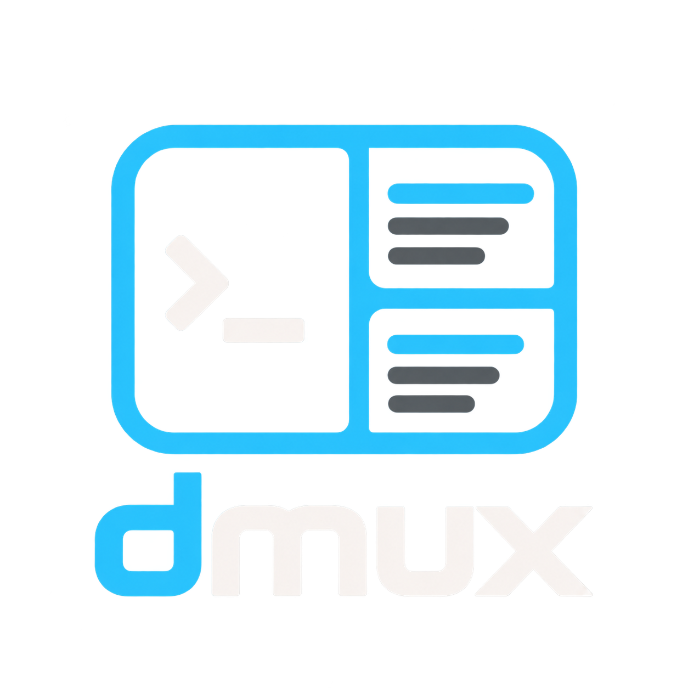
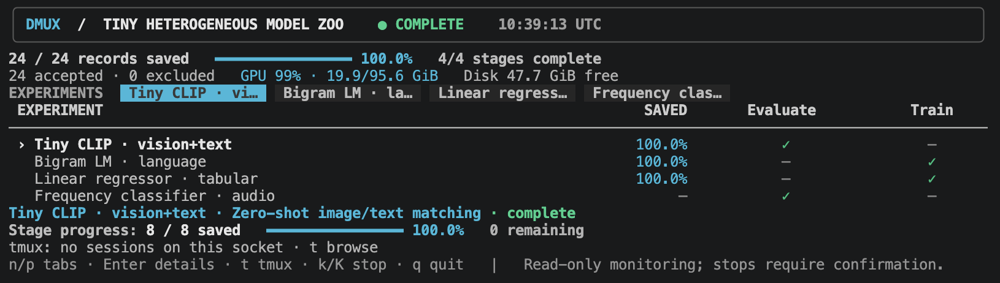
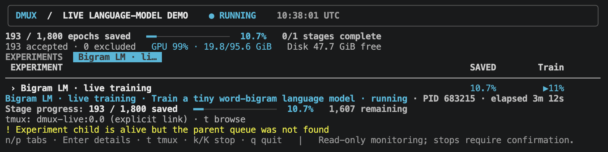
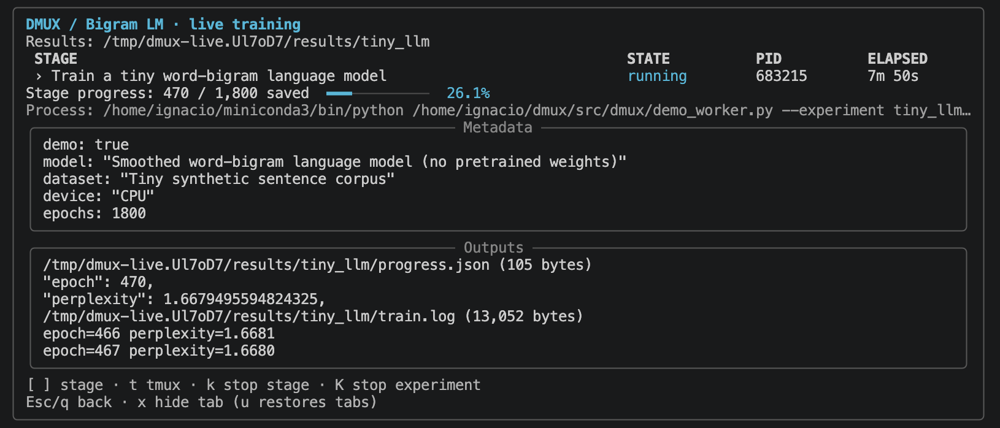
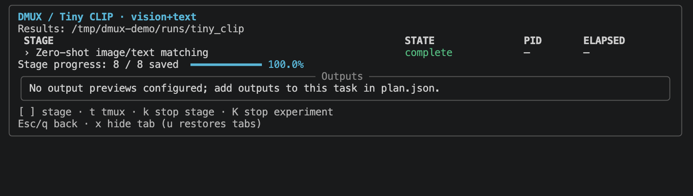
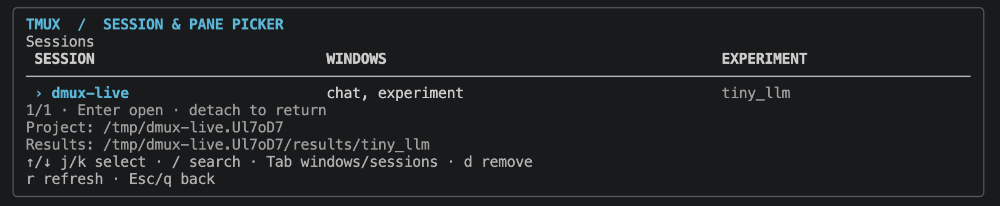

<p align="center">
  
</p>

# dmux

`dmux` is a terminal workspace and monitor for machine-learning experiments.
It connects to files and processes an experiment already produces; it does not
require the training code to import dmux, and closing the dashboard leaves jobs
running.

The interface combines visual experiment tabs, a pipeline overview, exact
stage counters, responsive detail panels, resource telemetry, recent logs, and
optional tmux workspaces for experiments and AI CLI chats.



Compare vision/text, language, tabular, and audio experiments in one overview.
Use `n` / `p` to select a tab, then Enter to inspect it. The audio example has
only completion artifacts, so it shows a completed stage without inventing a
saved-count percentage.

## Install

```bash
python -m pip install -e '.[dev]'
```

Runtime dependencies are `rich` and `psutil`. `tmux` and `nvidia-smi` are
optional external tools; no model weights or inference frameworks are imported.

## Try the heterogeneous model-zoo demo

Run four real, tiny, dependency-free workloads: a CLIP-like vision-language
matcher, a bigram language model, a tabular linear regressor, and an audio
frequency classifier. They emit JSONL metrics, rewritten JSON status,
checkpoint files, logs, and completion artifacts:

```bash
dmux demo --project-root /tmp/dmux-demo --tmux
dmux watch --project-root /tmp/dmux-demo --queue monitor
```

Each experiment gets its own tmux session, with `chat` and `experiment` windows.
Start your preferred AI CLI in the chat window. The worker window keeps its
output and opens a shell when the demo finishes. The dashboard reads the session
links automatically. Omit `--tmux` to run the demo without tmux; use a fresh demo
directory for each run. These are tiny deterministic fixtures; the vision/text
matcher illustrates a dual-encoder workflow without loading pretrained CLIP.

| Key | Action |
| --- | --- |
| `n` / `p` | Select an experiment tab |
| Enter | Open experiment details: stages, PIDs, metadata, outputs |
| `[` / `]` | Select a stage |
| `t` | Open the tmux browser |
| `k` / `K` | Stop the selected stage / whole experiment, after confirmation |
| `x` / `u` | Hide the selected tab / restore hidden tabs; jobs continue |
| Esc / `q` | Return from details; `q` on the overview closes dmux |

Non-interactive consumers can use:

```bash
dmux snapshot --adapter filesystem --project-root /tmp/dmux-demo --queue monitor
dmux json --adapter filesystem --project-root /tmp/dmux-demo --queue monitor
```

### Reading a live run



- The top counter summarizes the whole plan. Here, `193 / 1,800` epochs are
  saved and `0/1` stages are complete.
- The selected experiment and its current stage have separate progress displays.
  They match in this single-stage example; `10.7%` measures saved epochs, not
  elapsed time or an ETA.
- The active-process line shows the matched PID and its elapsed runtime. Press
  `t` to browse the linked tmux workspace, or Enter to inspect the experiment.
- GPU readings describe device-wide activity, not usage attributed to this
  experiment. This tiny language model runs on CPU; the screenshot's busy GPU
  can belong to other workloads.

The yellow parent-queue warning in this capture comes from a standalone worker
with no queue runner. It does not mean the displayed process has stopped.
Closing dmux leaves that process running; explicit stops require confirmation.

### Connect existing experiment files

The declarative [`plan.json` schema](docs/PLAN_SCHEMA.md) supports:

- append-only JSONL with configurable identity, semantic duplicate detection,
  status sets, allowed values, and grouped progress;
- periodically rewritten JSON with dotted current/total fields;
- file/glob counts for checkpoints, shards, or result partitions;
- JSON or plain-file completion artifacts with required companion files;
- sanitized bounded log tails and optional process matching.

All relative task paths resolve against an explicit `--project-root` or the
`project_root` declared by the plan—not dmux's installation directory.
The generic `filesystem` adapter is the `dmux` command's default; specialized
adapters are always selected explicitly.

## Point a project at its outputs

Keep the monitoring plan beside your code while reading an external result disk:

```bash
dmux watch --project-root /work/vision --queue monitor --results-dir /data/vision-results
```

Task directories in `monitor/plan.json` resolve beneath the chosen result
directory. Absolute task paths remain absolute. A plan can also declare separate
`root` and `results_dir` settings for each named project; see
[the project configuration](docs/PLAN_SCHEMA.md#multiple-projects).



Enter opens this detail view. Use `[` / `]` to choose a stage and Esc to return
to the overview. The running stage shows its PID, elapsed runtime, and process
command. Metadata comes from the plan; in this capture it identifies the model,
dataset, CPU device, and epoch count. The Outputs panel previews the configured
`progress.json` and `train.log` files, including perplexity and recent log lines.

`k` / `K` request a confirmed stage / experiment stop; `x` only hides the tab
and leaves jobs running.

Add `metadata` and `outputs` to a task to display experiment context and preview
generated files:

```json
{
  "run": "clip",
  "stage": "evaluate",
  "directory": "clip-eval",
  "metadata": {"dataset": "validation", "seed": 7},
  "outputs": ["metrics.json", "predictions.jsonl"],
  "log": "evaluate.log"
}
```

Previews read bounded text from configured files. Binary artifacts are listed
by path and size.

<details>
<summary>What if output previews are not configured?</summary>



Monitoring progress does not require output previews. This completed experiment
still shows its results directory and `8 / 8` saved records; the Outputs panel
explains how to enable previews. A dash under PID means no matching live process
was found. If outputs are configured but their files do not exist yet, dmux waits
for them to appear without creating or modifying them.

</details>

## tmux sessions and AI chats

Press `t` from the dashboard or run `dmux sessions` directly. Use `/` to search,
Tab to switch between sessions and windows, and Enter to open the selection.
Project and result directories appear for workspaces created by dmux.



The selected `dmux-live` session contains independent `chat` and `experiment`
windows and is linked to `tiny_llm`. Use the arrow keys or `j` / `k` to select a
session; Tab lets you choose a specific window/pane before pressing Enter.
The project and results paths show which workspace you are entering. Browsing
does not create sessions or send commands into existing chats.

Create a project chat workspace:

```bash
dmux sessions new vision --project-root /work/vision --results-dir /data/vision-results
dmux sessions
```

The initial `chat` window opens a shell. To launch a chosen CLI directly, append
`--` followed by its executable and arguments. The command receives
`DMUX_PROJECT_ROOT` and `DMUX_RESULTS_DIR`. Normal tmux window creation remains
available for additional independent chats.

Press `d` in the browser to remove a selected session. Review its panes, then
type the exact session name and press Enter. Removal closes every window in that
session and can terminate its jobs and chats; result files remain on disk.
Esc cancels. Scriptable equivalent:

```bash
dmux sessions remove vision --confirm vision
```

`--tmux-socket PATH` selects a server for `demo`, `sessions`, or `watch`. Inside a
tmux session, removing the browser's own session is refused; open the browser
outside that session first. Session commands use numeric IDs and direct argument
execution as documented by the [tmux manual](https://man.openbsd.org/tmux).

Inside tmux, dmux switches only a uniquely identified client. Outside tmux, it
attaches and returns after detachment. Terminal settings are restored before
handoff and on every exit path.

## Stop a stage or experiment

`k` targets the selected stage; `K` targets all currently live stages of the
experiment. The confirmation shows PIDs and child processes. dmux verifies their
start times and commands before requesting SIGTERM. It never escalates to a force
kill automatically. To do the same from a command:

```bash
dmux kill --project-root /work/vision --queue monitor --model clip --stage evaluate
```

Omit `--stage` to stop all live stages in the experiment. Interactive use asks
for the exact experiment or experiment/stage label; scripts must provide it via
`--confirm`. The parent queue is not stopped and may schedule additional work.
Stopping a stage preserves its tmux chat windows and output files.

## Adapter API

The built-in filesystem adapter covers common layouts without experiment-code
changes. Specialized scientific invariants belong in an adapter implementing
`dmux.ExperimentAdapter`. Third-party packages can register one through the
`dmux.adapters` entry-point group:

```toml
[project.entry-points."dmux.adapters"]
my_lab = "my_lab.dmux_adapter:MyLabAdapter"
```

The separation is deliberate: connectors read bytes, adapters interpret them,
the monitor aggregates snapshots, and the UI renders those snapshots.
See [AGENTS.md](AGENTS.md) before changing integrity or navigation behavior.

## Development

```bash
pytest -q
python -m dmux --help
```

The suite includes the original 40 tests and tiny-model coverage for JSON,
JSONL, logs, artifacts, explicit project-root resolution, responsive visuals,
terminal restoration, and tmux integration on private temporary sockets.
