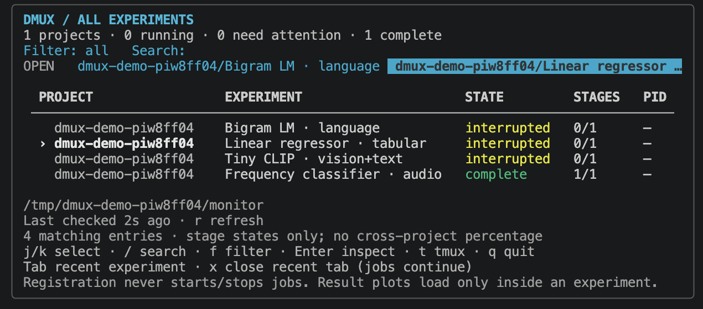

# Global home and project registration

Run `dmux` from any directory to see all explicitly registered projects and their
experiments. Registration is local to your user account and machine. dmux does
not search your computer for results, run project code, or require a service.



Here the tabular experiment is selected, three runs are marked interrupted, and
the audio run is complete. The recent-tab strip provides quick access to opened
experiments; it is separate from the project registration list.

## Register an existing plan

```bash
dmux add /work/vision
dmux add /work/language --name language-lab
dmux add /work/vision/monitor/plan.json --name vision-lab
dmux projects list
dmux
```

A directory checks `plan.json`, then `monitor/plan.json`. You can also supply an
exact plan path. Plans must use the generic filesystem schema. For a new plan:

```bash
dmux init --results-dir /data/vision-results --register
```

The wizard offers registration separately after creating a plan. `--yes` alone
does not register it; use `--register`. `--dry-run` never writes either file.
If registration fails, the new plan is retained and the error explains how to
retry. Optional adapter-specific workflows remain available through the scoped
`dmux watch --adapter ...` command.

Registration stores only a name, stable registration ID, absolute plan location,
project root, and any explicit results override. Add the same plan again to
update its name or location overrides; it is not duplicated and keeps its ID:

```bash
dmux add /work/vision --name vision-renamed --results-dir /data/new-results
```

An existing explicit results override is retained when omitted on later adds.
To change it, supply the intended `--results-dir`. Registration names must be
unique; use `--name` to distinguish projects with the same directory basename.
If a plan lacks a project root, register its project directory or pass
`--project-root` explicitly. An exact plan path alone otherwise uses its parent.

## Navigate

| Key | Action |
| --- | --- |
| `j` / `k`, arrows | Select a row |
| `/` | Search project names, experiment labels, or tags; Enter finishes editing |
| `f` | Cycle all / running / attention filters |
| Enter | Open the selected experiment directly in its detail view |
| Esc / `q` in details | Return to the global home |
| `t` | Browse the selected project's configured tmux server |
| Tab | Select a recently opened experiment |
| `x` | Close its recent tab; keep registration, jobs and files |
| `r` | Schedule fresh checks, including completed projects |
| `q` on home | Exit; all experiment jobs continue |

Up to eight recently opened tabs and the selection are remembered between
interactive sessions. Searching filters the list, not the running experiments.
Within a project, existing `n`/`p` experiment navigation, `[`/`]` stage navigation,
and explicit confirmed stop controls remain available.

The home screen groups by project and prioritizes attention/running states
inside each group. It shows stage completion and real matched PIDs, not a sum
of unlike progress units. A missing PID does not prove a remote or inaccessible
job has stopped. Missing, empty, or broken plans remain visible; they are never
silently unregistered. Use `dmux doctor --plan-dir PATH` to diagnose them.

## Keep operations distinct

```bash
dmux remove vision-renamed
```

Removal requires one exact registration name or ID and changes only the catalog.
Re-add the plan to restore access. It does not delete the plan/results, close
tmux sessions, or signal processes. Session removal and worker stop commands
retain their separate review/confirmation workflows.

The experiment tag is a stable run identity, not its display label. Change the
optional experiment catalog's `label` to rename a run visually. For a new
execution, use a new experiment tag and output directory; do not overwrite
previous results. Within a plan, an experiment/stage identity must be unique.
Across registrations, the registration ID namespaces otherwise identical tags.

## Storage and efficiency

On Linux, dmux honors absolute `XDG_CONFIG_HOME` and `XDG_STATE_HOME` settings:

- Catalog: `$XDG_CONFIG_HOME/dmux/projects.json`, default `~/.config/dmux/projects.json`.
- View state: `$XDG_STATE_HOME/dmux/home.json`, default `~/.local/state/dmux/home.json`.

The catalog is versioned JSON, limited to 1 MiB and 1,000 registrations. Updates
take a short exclusive file lock and replace the file atomically. Corrupt or
unsupported catalogs fail closed instead of being overwritten. Symlink targets
are not replaced. Private settings files are created with restrictive access.
Read-only/list/non-interactive commands do not create settings directories.

The global monitor shares process enumeration (two-second cache) and GPU
sampling (five-second cache) across projects. It refreshes at most four due
projects per interactive tick, rotating fairly. Completed projects back off to
30 seconds; other projects are eligible every two seconds. The selected row
shows when it was last checked. Actual latency can be longer for many projects
or slow filesystems. `r` makes projects eligible again; it does not restart jobs.

History plots are separate from progress: their files are not read until an
experiment is opened. Metric caches live only in memory; no result data or PIDs
are written into the registration list or persistent view state.

## CLI compatibility

Bare `dmux` now means global home, even inside a project. Use `dmux watch` for
the previous current-project behavior. Explicit project flags and the existing
`snapshot`, `json`, `kill`, and `sessions` commands retain their scoped meaning.

```bash
dmux home --once --no-gpu        # Global human-readable snapshot
dmux home --json --no-gpu        # Global machine-readable rows
dmux projects list --json       # Registration metadata only
dmux watch --project-root /work/vision
dmux json --project-root /work/vision
```

For a self-contained tour: `dmux demo --live --register`. Add `--tmux` only if
you want it to create per-experiment chat/worker sessions. Demos and tests remain
tiny and dependency-free; tests isolate all user settings and tmux sockets.
